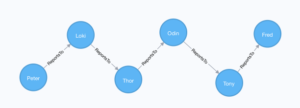

> Breadcrumb in SQl and Graph

In the past I have been involved in multiple projects that display a hierarchy of some sort.  Whether that be an accounting book structure or a people reporting hierarchy.

They are normally built in a similar way within SQL.. Table contains a row that self joins to a parent ID
In the following example I will walk you through building up a table In SQL Server that contains people and who they report to. Then displaying this information as a breadcrumb for a particular person.  eg "Tom>Dick>Harry"

Lets create the table in SQL and populate it:
```sql
BEGIN TRY
    DROP TABLE dbo.[User]
END TRY
BEGIN CATCH
    -- Not created yet
END CATCH

GO

CREATE TABLE dbo.[User]
(
      UserID INT
    , UserName VARCHAR(50)
    , PrimaryLocation VARCHAR(50)
    , ManagerID INT
);

WITH X AS
(
        SELECT 
              UserID
            , UserName
            , PrimaryLocation
            , ManagerID
        FROM
        (
              VALUES 
               ( 1, 'Fred', 'UK', NULL)
            ,  ( 2, 'Barney', 'UK', 1)
            ,  ( 3, 'Wilma', 'UK', NULL)
            ,  ( 4, 'Betty', 'USA', 3)
            ,  ( 5, 'Pebbles', 'USA', 2)
            ,  ( 6, 'Bam Bam', 'CHN', 3)
            ,  ( 7, 'Tony', 'USA', 1)
            ,  ( 8, 'Bruce', 'USA', 7)
            ,  ( 9, 'Odin', 'ASG', 7)
            ,  ( 10, 'Thor', 'ASG', 9)
            ,  ( 11, 'Loki', 'ASG', 10)
            ,  ( 12, 'Peter', 'USA', 11)
        ) AS Users ( UserID, UserName, PrimaryLocation, ManagerID)
)
INSERT INTO dbo.[User]
SELECT *
FROM X
```


We shall do the same in NEO to give an similar graphical representation

```sql
WITH [ {
    UserID : 1,
    UserName : "Fred",
    PrimaryLocation : "UK"
  }, {
    UserID : 2,
    UserName : "Barney",
    PrimaryLocation : "UK"
  }, {
    UserID : 3,
    UserName : "Wilma",
    PrimaryLocation : "UK"
  }, {
    UserID : 4,
    UserName : "Betty",
    PrimaryLocation : "USA"
  }, {
    UserID : 5,
    UserName : "Pebbles",
    PrimaryLocation : "USA"
  }, {
    UserID : 6,
    UserName : "Bam Bam",
    PrimaryLocation : "CHN"
  }, {
    UserID : 7,
    UserName : "Tony",
    PrimaryLocation : "USA"
  }, {
    UserID : 8,
    UserName : "Bruce",
    PrimaryLocation : "USA"
  }, {
    UserID : 9,
    UserName : "Odin",
    PrimaryLocation : "ASG"
  }, {
    UserID : 10,
    UserName : "Thor",
    PrimaryLocation : "ASG"
  }, {
    UserID : 11,
    UserName : "Loki",
    PrimaryLocation : "ASG"
  }, {
    UserID : 12,
    UserName : "Peter",
    PrimaryLocation : "USA"
  } ] AS U
UNWIND U AS Users
CREATE (n:User)
SET n = Users
;

MATCH (n:User { UserID: 2 }), (m:User { UserID: 1 }) 
WHERE n<>m 
CREATE (n)-[r:ReportsTo]->(m) 
RETURN r;

MATCH (n:User { UserID: 4 }), (m:User { UserID: 3 }) 
WHERE n<>m 
CREATE (n)-[r:ReportsTo]->(m) 
RETURN r;

MATCH (n:User { UserID: 5 }), (m:User { UserID: 2 }) 
WHERE n<>m 
CREATE (n)-[r:ReportsTo]->(m) 
RETURN r;

MATCH (n:User { UserID: 6 }), (m:User { UserID: 3 }) 
WHERE n<>m 
CREATE (n)-[r:ReportsTo]->(m) 
RETURN r;

MATCH (n:User { UserID: 7 }), (m:User { UserID: 1 }) 
WHERE n<>m 
CREATE (n)-[r:ReportsTo]->(m) 
RETURN r;

MATCH (n:User { UserID: 8 }), (m:User { UserID: 7 }) 
WHERE n<>m 
CREATE (n)-[r:ReportsTo]->(m) 
RETURN r;

MATCH (n:User { UserID: 9 }), (m:User { UserID: 7 }) 
WHERE n<>m 
CREATE (n)-[r:ReportsTo]->(m) 
RETURN r;

MATCH (n:User { UserID: 10 }), (m:User { UserID: 9 }) 
WHERE n<>m 
CREATE (n)-[r:ReportsTo]->(m) 
RETURN r;

MATCH (n:User { UserID: 11 }), (m:User { UserID: 10 }) 
WHERE n<>m 
CREATE (n)-[r:ReportsTo]->(m) 
RETURN r;

MATCH (n:User { UserID: 12 }), (m:User { UserID: 11 }) 
WHERE n<>m 
CREATE (n)-[r:ReportsTo]->(m) 
RETURN r;
```


When focusing on the User "Peter" and showing his management chain we would use the following CTE

```sql
WITH Connections
AS
(
    SELECT 
          UserID
        , UserName
        , PrimaryLocation
        , ManagerID
        , Position = 0
        , ChainUserNames = CAST(UserName AS VARCHAR(MAX))
    FROM dbo.[User]
    WHERE ManagerID IS NULL -- TOP Levels

    UNION ALL

    SELECT 
          U.UserID
        , U.UserName
        , U.PrimaryLocation
        , U.ManagerID
        , Position = C.Position + 1 
        , ChainUserNames =  CAST(U.UserName AS VARCHAR(MAX)) + '>' + C.ChainUserNames
    FROM dbo.[User]             U
        INNER JOIN Connections  C   ON  C.UserID = U.ManagerID
)
SELECT *
FROM Connections
WHERE UserID = 12 -- Peter
```


So what this query is doing is the following:
- Building up a self joining CTE
    - Identifying top level managers .. i.e. people who dont report to anyone
    - Considering top level managers to be at position '0'
    - Set up the starting to write the breadcrumb
    - 
    - Join children to parents
    - Increase Position (away from top level manager) by 1
    - Append to the breadcrum
- Select from the CTE and limit to the one user in question


So firstly lets starts with just querying this one person in cypher and return his chain

```sql
MATCH (u:User {UserID: 12})-[:ReportsTo*]->(m:User) 
RETURN u,m
```



Using this, we can now compress the relationships into a list.

```sql
MATCH u:User {UserID: 12})-[:ReportsTo*]->(m:User)
  WITH 
        COLLECT(m.UserName) AS c
      , u.UserID AS ID
      , u.UserName AS Name
      , u.PrimaryLocation AS Location
RETURN 
    ID
  , Name
  , Location
  , LENGTH(c) AS Position
  , apoc.text.join(c, ">") AS Managers
```

The above query does the following:
- Filter on user id 12
- Link via relationship and keep travesing "ReportsTo*"
- Group the parents into a List of User Names
- Alias the properties we we to bring through
- Return the alaises
- Return the list and inject ">" between each item.  I used the APOC function to achive this to save on a little hastle


> Side note

While i was writing this, I made use of a useful query to count the amount of reports that globally roll up to each person.
I achieved this in cypher by running

```sql
MATCH (u:User)<-[r:ReportsTo*]-(m:User)
RETURN 
	  u.UserName AS UserName
    , COUNT(r) AS NumberOfReports
```


