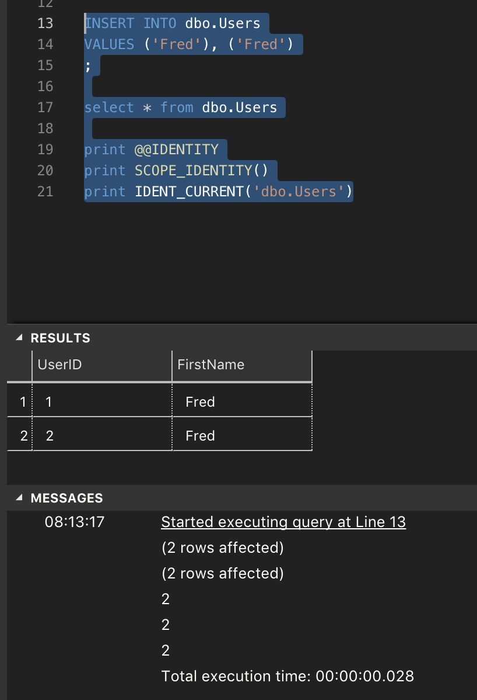
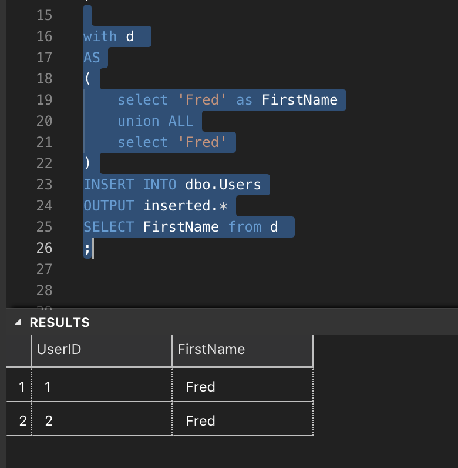
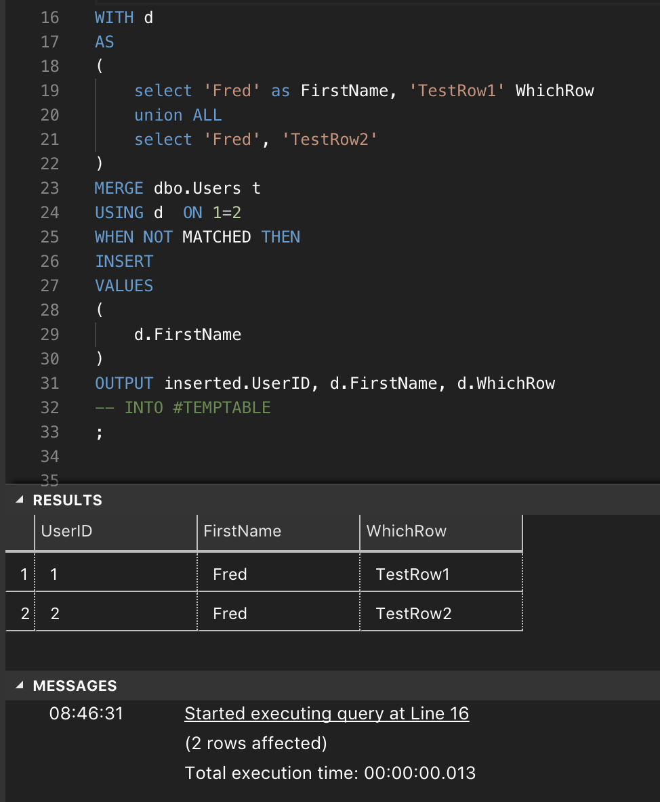

> Using merge to capture bulk insert identities in SQL Server

On one occasion I encountered an _interesting_ piece of code.

There was a user table and the only unique identifier was the identity field itself.  I would guess as the month and years progressed this table was enriched with additional columns until someone decided to call a halt on adding columns, but rather created a key value pair table to store additional attributes.

So this led to an interesting insert process.  Inserting a single row was fairly simple.  i.e. Insert row into main table, use the scope_identity to then insert additional details into the key value pair table.

However, the process to insert in bulk made use of cursors and xml.  Each row was processed within a cursor row by row to allow the identity of the first insert to be used to join it the key value pair table.  I assume that this was done, because, if the data was inserted in bulk into the first table first, there would be no way to join back to it to identify the identities that had just been created, because there was no secondary unique identitfier.

tl:dr

Whatever your reason may be, I sometimes use this little feature of the merge statement to capture identities

>Before we go anywhere, lets have a quick overview of scope identity
#### Scope Identities

##### SCOPE_IDENTITY()

This will return the identity of the last inserted value.  It will be limited to the current session and the current scope.
i.e. If you insert into a table and that table has a trigger to insert into a second table, it will return the value of the first table.

##### @@IDENTITY

This will return the identity of the last inserted value.  It will be limited to the current session.
i.e. If you insert into a table and that table has a trigger to insert into a second table, it will return the value of the second table.

##### IDENT_CURRENT('table')
This will return the identity of the last inserted value. It is not bound to any session.


>Now that we've got this out of the way, lets focus on bulk capturing rather than individual inserts

#### Steps to capture indentites using merge
##### 1. Create a test table

```sql
CREATE TABLE dbo.Users
(
      UserID INT IDENTITY(1,1)
    , FirstName VARCHAR(100)
)
```
The unique key is the ID.. So if we were to insert 'Fred' twice it would be impossible after the inserts are successful to capture which process created the entry. (I know it's bad table design :))

##### 2. Playing with scope identities

```sql
INSERT INTO dbo.Users
VALUES ('Fred'), ('Fred')
;

select * from dbo.Users

print @@IDENTITY
print SCOPE_IDENTITY()
print IDENT_CURRENT('dbo.Users')
```


As you can see, two rows were inserted and the final output from the scope identities show the final ID as 2 and obviously disregard the first.

SQL server does also offer the _inserted_ table as reference via the _output_ clause.

But there is still no way that this can be tied back to the original data. The source dataset cannot be referenced within the output cluase.


>Roll on the merge syntax
##### Merge

```sql
WITH d 
AS
(
    select 'Fred' as FirstName, 'TestRow1' WhichRow
    union ALL
    select 'Fred', 'TestRow2'
)
MERGE dbo.Users t
USING d  ON 1=2 
WHEN NOT MATCHED THEN 
INSERT 
VALUES
(
    d.FirstName
)
OUTPUT inserted.UserID, d.FirstName, d.WhichRow
-- INTO #TEMPTABLE
;
```


So breaking this down
- The CTE constructs two rows to be inserted.  The column "WhichRow" is used to verify the data at the end
- Merge against the User table
- Merge using 1=2 .. This means that every row in the source dataset will be treated as not matched
- Insert the data
- Return the inserted data and the source data together via the output clause
- Note: the could be directed into a temp table to be used for a second process