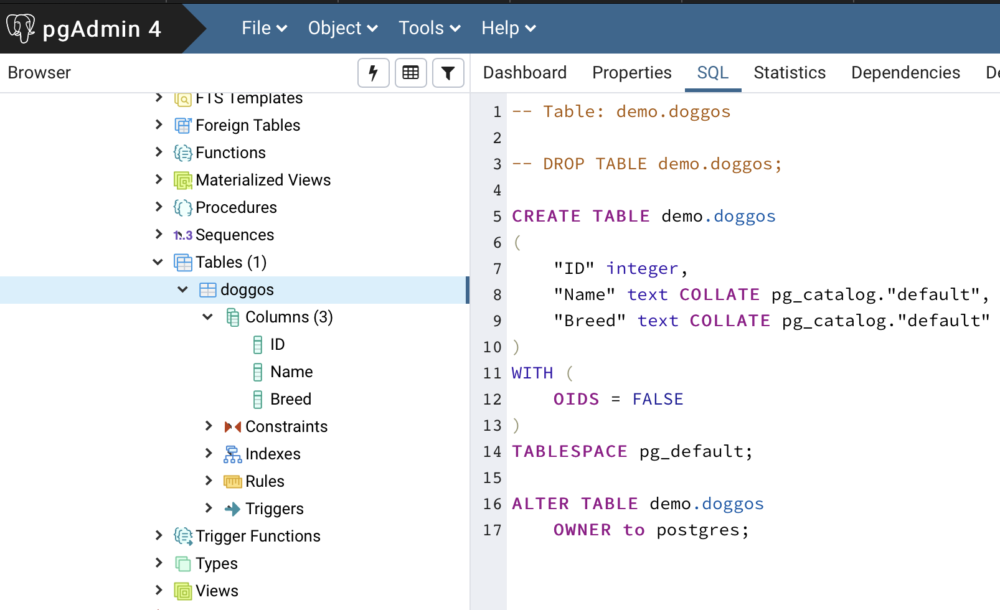

_Publish date: 2019-05-31_

> Golang and Databases - Part 1

When I moved into the world of cloud, open source, big data etc. I quickly learned that a data engineer needs to be someone who can do just more than write advanced SQL, procs, data admin and ETL. I need to have a 'general' understanding of the back end code as well. My current position has exposed me to Golang (and python).

Over the next few posts I will go into detail on how to interact with postgres and dynamo and create a simple CRUD (well maybe just CR) endpoint using clean architecture in Go.

# Notes

This blog is as much for my recollection as it is to help others
Rather than installing local databases I will be using docker images
If I have used examples/code from other sources, I'll give it a shout-out

There are sites much better at it explaining it than me but the tools/IDEs etc. I will be using are:

- OSX Terminal
- Bash
- Go Mod
- Visual Studio Code (with Go extension installed including **gofmt** for formatting)
- Docker (Postgres and Dynamo)
- PGAdmin

# My First Golang package connecting to Postgres

# Getting a local pg db running

> **SHOUT OUT** - [hackernoon.com](https://hackernoon.com/dont-install-postgres-docker-pull-postgres-bee20e200198)

To get golang talking to Postgres locally, we'll need some sort of pg database running. The quickest and easiest way to do this is to pull down a docker image and run it.

The following steps can accomplish this (in bash):

```bash

docker pull postgres

mkdir -p $HOME/docker/volumes/postgres

docker run --rm   --name pg-docker -e POSTGRES_PASSWORD=postgres_docker -d -p 5432:5432 -v $HOME/docker/volumes/postgres:/var/lib/postgresql/data  postgres
```

> The bash above has started the db running on **localhost**, port **5432**, password **postgres_docker** and physically stored at **\$HOME/docker/volumes/postgres:/var/lib/postgresql/data**

With that up and running you should now be able to connect to it using any DB IDE tool of your choosing. I'll just use PG admin in this case.

Lets create a doggo table



```sql
CREATE TABLE demo.doggos
(
      "ID"    integer
    , "Name"  text
    , "Breed" text
)
```

# Interaction from Go

Create a need go mod project in a directory of your choice.

```bash
go mod init doggos
touch main.go
```

This will initialise a new project and create the main.go file to write the code into.

> I will include all of the main.go code at the end.

# Imports

```go
package main

import (
	"database/sql"
	"fmt"
	"os"

	// Used in conjunction with database/sql" to provide Postgres driver
	_ "github.com/lib/pq"
)
```

I will use these for:

- database/sql: used for db interaction
- fmt: printing out and string manipulation
- os: pulling environment variables
- github.com/lib/pq: Extends the `database/sql` import to add postgres compatibility

# Variables

```go
var (
	host     string
	port     string
	user     string
	password string
	dbname   string
)

func loadOSEnvs() {
	host = os.Getenv("pgHost")
	port = os.Getenv("pgPort")
	user = os.Getenv("pgUser")
	password = os.Getenv("pgPassword")
	dbname = os.Getenv("pgDbName")
}
```

This creates all the variables needed to connect to the pg database. The os.Getenv command will assign the variable from environment variables

# Defining the table object

```go
type Doggo struct {
	ID    string `json:"ID"`
	Name  string `json:"Name"`
	Breed string `json:"Breed"`
}

type Doggos []Doggo
```

The first struct defines the 3 columns. The second creates an array of them.

# Main

> The rest of the logic will take place in the main func
>
> ```go
> func main() {
> 	loadOSEnvs()
> }
> ```

I will not be raising errors/panics but just printing to the console. It will also be, somewhat uncommented.

# Database Connection

```go
	psqlInfo := fmt.Sprintf("host=%s port=%s user=%s password=%s dbname=%s sslmode=disable", host, port, user, password, dbname)

	db, err := sql.Open("postgres", psqlInfo)
	if err != nil {
		fmt.Println(err)
	}

	err = db.Ping()
	if err != nil {
		fmt.Println(err)
	}

    defer db.Close()
```

- psqlInfo: Connection string using the environment variables.
- sql.Open: Attempt to connect to the db using the connection string. Connection and error variables are stored. If there is an error ii will be printed to the console.
- dp.Ping: Attempt to ping the database. If there is an error ii will be printed to the console
- defer: Keeps the connection open until the func using it has completed

# Writing a row

```go
	sqlStatement := `TRUNCATE TABLE demo.doggos`
	_, err = db.Exec(sqlStatement)
	if err != nil {
		fmt.Println(err)
	}

	sqlStatement = `INSERT INTO demo.doggos ("ID", "Name", "Breed" ) VALUES (1,'Patch','Lab')`
	_, err = db.Exec(sqlStatement)
	if err != nil {
		fmt.Println(err)
    }
```

- Creates a truncate script and then executes it
- Create an insert script and then executes it

# Reading the contents

```go
rows, err := db.Query(`select "ID", "Name", "Breed" from demo.doggos`)
	if err != nil {
		fmt.Println(err)
	}

	doggo := Doggo{}
	doggoList := Doggos{}

	for rows.Next() {
		err := rows.Scan(&doggo.ID, &doggo.Name, &doggo.Breed)
		if err != nil {
			fmt.Println(err)
		}
		doggoList = append(doggoList, doggo)
	}
	err = rows.Err()
	if err != nil {
		fmt.Println(err)
	}

	fmt.Println(doggoList)
    }
```

- db.Query: Reads the three columns and stores the contents in `rows`. If there is an error it will be printed to the console
- doggo: Sets up an empty holder for a row. Doggo Struct was created earlier.
- doggoList: Sets up an empty holder for a collection of rows. Doggos Struct was created earlier.
- for rows.Next() { : The code within that block will be run for each row. If there is an error it will be printed to the console
- rows.Scan: row Columns are mapped to the columns in the doggo variable. If there is an error it will be printed to the console
- doggoList = append: For each doggo collect it will be added to the list of doggos
- fmt.Println(doggoList): The List of dogs will be written to the console

# Running the code

Within terminal run the following command

```bash
export pgHost=localhost
export pgPort=5432
export pgUser=postgres
export pgPassword=postgres_docker
export pgDbName=postgres

go run .
```

The output should look like this:

```bash
$ go run .
[{1 Patch Lab}]
```

The data returned `[{1 Patch Lab}]` is the one row the we inserted at the start being read out at the end.

# Entire code

```go
package main

import (
	"database/sql"
	"fmt"
	"os"

	// Used in conjunction with database/sql" to provide Postgres driver
	_ "github.com/lib/pq"
)

var (
	host     string
	port     string
	user     string
	password string
	dbname   string
)

func loadOSEnvs() {
	host = os.Getenv("pgHost")
	port = os.Getenv("pgPort")
	user = os.Getenv("pgUser")
	password = os.Getenv("pgPassword")
	dbname = os.Getenv("pgDbName")
}

type Doggo struct {
	ID    string `json:"ID"`
	Name  string `json:"Name"`
	Breed string `json:"Breed"`
}

type Doggos []Doggo

func main() {
	loadOSEnvs()


	psqlInfo := fmt.Sprintf("host=%s port=%s user=%s password=%s dbname=%s sslmode=disable", host, port, user, password, dbname)

	db, err := sql.Open("postgres", psqlInfo)
	if err != nil {
		fmt.Println(err)
	}

	err = db.Ping()
	if err != nil {
		fmt.Println(err)
	}

	defer db.Close()

	sqlStatement := `TRUNCATE TABLE demo.doggos`
	_, err = db.Exec(sqlStatement)
	if err != nil {
		fmt.Println(err)
	}

	sqlStatement = `INSERT INTO demo.doggos ("ID", "Name", "Breed" ) VALUES (1,'Patch','Lab')`
	_, err = db.Exec(sqlStatement)
	if err != nil {
		fmt.Println(err)
	}


	rows, err := db.Query(`select "ID", "Name", "Breed" from demo.doggos`)
	if err != nil {
		fmt.Println(err)
	}

	doggo := Doggo{}
	doggoList := Doggos{}

	for rows.Next() {
		err := rows.Scan(&doggo.ID, &doggo.Name, &doggo.Breed)
		if err != nil {
			fmt.Println(err)
		}
		doggoList = append(doggoList, doggo)
	}
	err = rows.Err()
	if err != nil {
		fmt.Println(err)
	}

	fmt.Println(doggoList)
}
```

# Coming up next

My set of blogs will use this as a basis to create an HTTP service that will provide endpoints to allow a user to perform CRUD actions.
