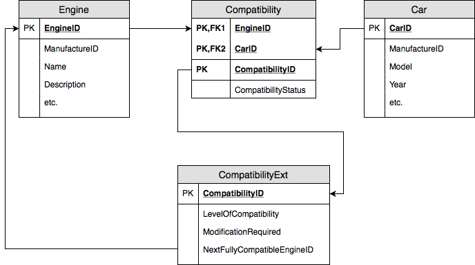
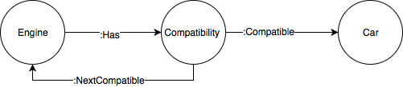
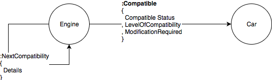

_Publish date: 2018-11-05_

> Many to Many (RDBMS to Graph)

One of the systems that I am currently working on is a migration from an Oracle DB to Graph. The ER diagram is similar to what can be seen in the original database.

An engine 'can' or 'cannot' be fitted into a car. Depending on the complexity required to place the engine into the car, the attributes are stored into a many-to-many (bridging table) and ext table. The ext table sometimes needs to have new columns added to it, should additional requirements come in. If the engine is not fully compatible, a relationship is created to identify the next engine from that manufacturer that would be fully compatible with the car.

The diagram below, shows how the model was originally ported.
As you can see, it mirrors the exact structure of the relational database. Attributes are stored into a 'bridging node' and no properties are stored within the edges. In essence, this is still the relational model. It does technically meet the requirements but doesn't take advantage of the Graph concepts.

I modified it to something similar to the diagram below. I'm sure this can still be refined, however this was an attempt to step away from the relational model and make use of the nodes and edges correctly.

The example shows that the edge ':Compatible' now contains the properties that refer to the car that it relates to. A second edge can be created to point to a better engine should the current one not meet the demands.

Of course, moving away from the RDBMS model, we get the benefit of holding additional properties on the nodes/edges should they be required, and there is no need to use mapping/bridging tables/nodes to create multiple relationships

I still feel that this has room for improvement, however it is a big step in taking that conceptual mind shift between technologies
